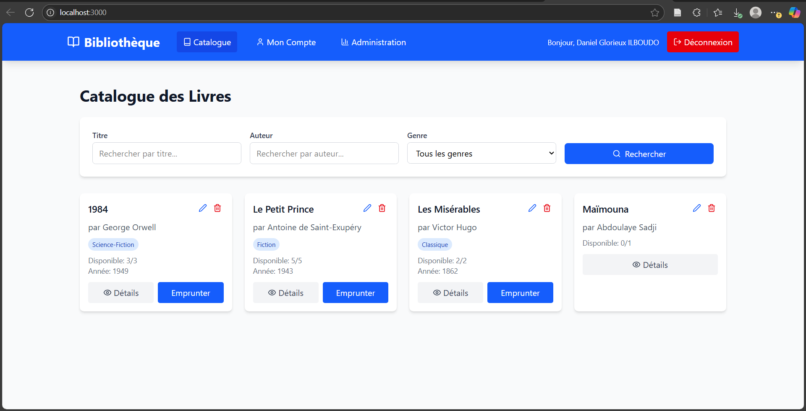

# Gestion de Bibliothèque

Une application web complète pour la gestion des emprunts de livres dans une bibliothèque universitaire. Ce projet est développé avec un backend Node.js (Express + MySQL) et un frontend React.js avec Tailwind CSS.

## Fonctionnalités principales

### Utilisateurs

- Inscription et connexion sécurisée (bcrypt + JWT)
- Rôles utilisateurs : `admin` et `étudiant`
- Tableau de bord personnalisé pour chaque rôle.

### Livres

- Gestion des livres : ajout, modification, suppression (admin uniquement)
- Visualisation des livres disponibles.

### Emprunts

- Emprunt d’un livre (si disponible).
- Retour d’un livre
- Suivi des dates de retour
- Statut des emprunts : `actif`, `retourné`, `en retard`

### Tableau de bord

- Statistiques dynamiques : nombre d’emprunts, retards, livres retournés
- Historique des emprunts
- Interface intuitive

## Stack technique

### Backend

- **Node.js** avec **Express**
- **MySQL** + **mysql2** (connexion + transactions)
- **JWT** pour l’authentification
- **bcrypt** pour le hachage des mots de passe
- **Sequelize** (optionnel si utilisé)

### Frontend

- **React.js**
- **Tailwind CSS**
- **React Router** pour la navigation
- **Axios** pour les appels API
- Icônes : **Lucide React**

### Frontend et Backend – Démarrage

npm install
npm run fullstack

### Frontend – Démarrage

cd frontend && npm run dev

### Backend – Démarrage

nodemon backend/index.js

### Schéma de base de données

voir backend/config/schema.sql

> ⚠️ **Important** : Veuillez mettre à jour les informations de la base de données (host, password, etc) dans backend/config/database.js.

> 📝 **Note** : Assurez-vous d'avoir Node.js version 20.18.3 installé.
